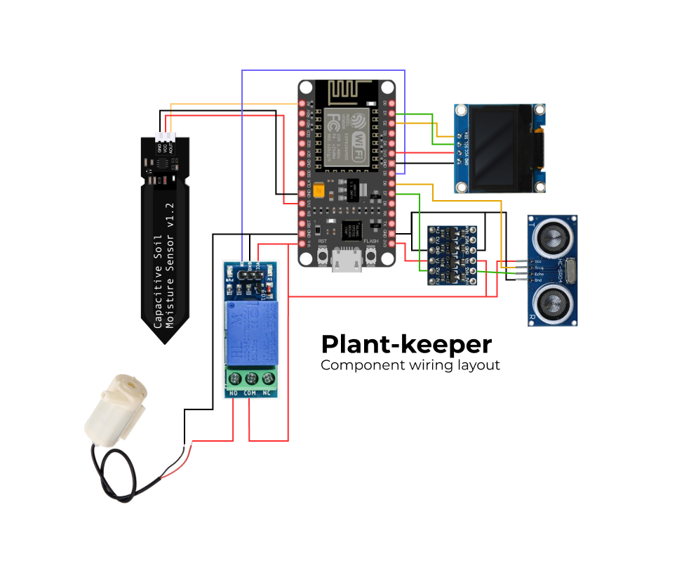

# Plant-keeper

Yet another fun little IoT project. As the name suggests, it's an automated device that can take care of your plants! Inspired by many other YT videos on this topic. The thing is, I couldn't find one who used platformIO for the software part. Also most of them were extremly simple, and in some way not reliable due to cheap/faulty moisture sensors. Therefore, I decided to try it myself.

## Schematic & parts

Parts used:
- breadboard (x1)
- ESP8266/32 (Default is 8266, You might have to change [platform.ini](./platformio.ini)) (x1)
- HC-SR04 (x1)
- Capacitive soil moisture sensor (x1)
- OLED 0.96 (x1)
- 5v Relay module (x1)
- Bi-directional level converter (x1)
- Submersible water-pump (x1)
- Jumper wires

### Schematic:


## Logic

Automatically waters the plant, once the moisture sensor reaches threshold percetage. All you need is displayed on OLED display and also on the blynk console. You can also control the pump via pressing the button on blynk console. Once the container is empty, status is updated to "container empty" and the whole thing starts running on "just display all readings" mode.

## Running locally

1. Clone this repo ```git clone https://github.com/alerrad/plant-keeper.git```
2. Open the folder in vscode with pre-installed "platformIO" extention
3. Create __config.h__ file inside __include__ folder and configure it
4. Assemble and wire all the parts together as shown in schematic
5. Build the project (ctrl + alt + b)
6. Connect your ESP board via usb and upload the build (ctrl + alt + u)
7. Enjoy! ✨

## License

This repo is licensed under [MIT License](./LICENSE).